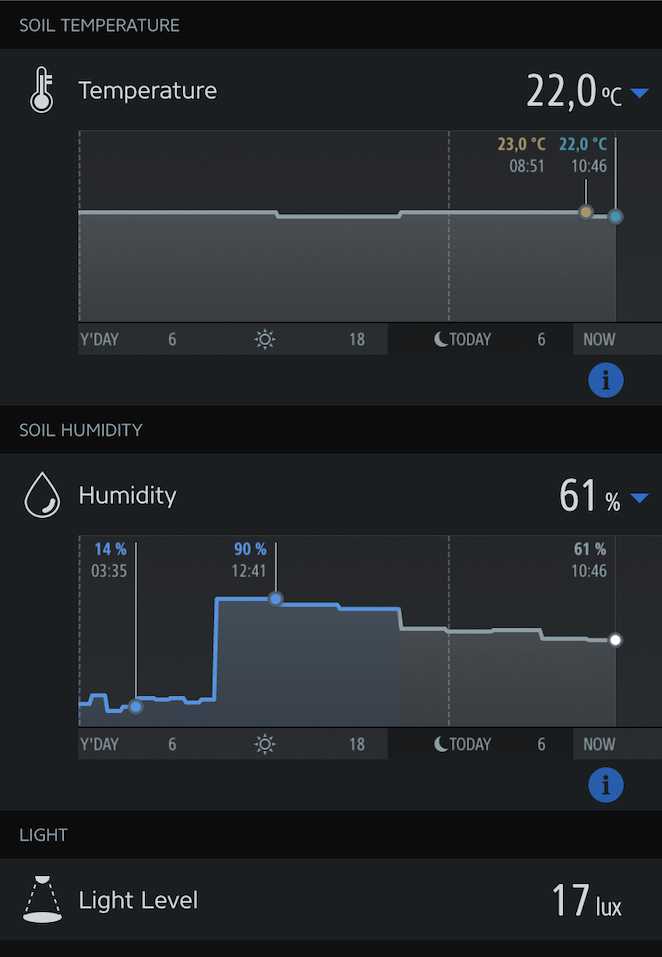

[](https://www.npmjs.com/package/homebridge-gardena-smart)
[](https://www.npmjs.com/package/homebridge-gardena-smart)
[](https://github.com/thboegel/homebridge-gardena-smart)
# homebridge-gardena-smart

This [homebridge](https://github.com/nfarina/homebridge) plugin provides Homekit and Eve support for Gardena smart sensors that allow to measure soil humidity, soil temperature and ambient light level. The requirement is a Gardena sensor that is connected to the [smart system](https://www.gardena.com/int/products/smart) via a Gardena gateway.
The plugin uses [fakegato-history](https://github.com/simont77/fakegato-history) to store and visualize a history of soil humidity and temperature.

## Screenshot


## Usage

`npm install -g homebridge-gardena-smart`

## Configuration

Add the following to your homebridge config.json
``` json
"accessories": [
	{  
		"accessory": "gardena-smart",  
		"name": "How your sensor should be named in Homekit",  
		"model": "Sensor Model",
		"username": "Gardena Username",
		"password": "Gardena Password",
		"updateInterval": "Time delay before new data are fetched from the Gardena API (recommendation: 300)"
	}  
],
```

## Credits
This plugin is a fork from [homebridge-gardena-mower](https://github.com/neuhausf/homebridge-gardena-mower) by [neuhausf](https://github.com/neuhausf).
